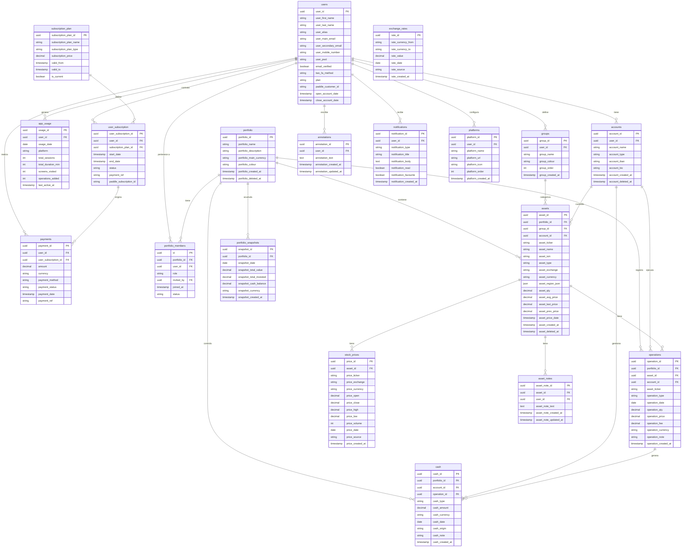

# portapp — Modelo de datos

> Versión 1.0 · Cerrado 2026-04-24  
> Enfoque: Kimball para analytics + 3FN para datos operacionales  
> Plataforma: PostgreSQL en Supabase
> **Este documento es la especificación del modelo de datos de producción — no describe el estado actual del prototipo HTML v6, que usa datos hardcodeados en variables JS.**

---

## Diagrama entidad-relación

---

## Resumen de tablas

| Tabla | Tipo | Descripción |
|---|---|---|
| `users` | Dimensión | Usuarios de la app |
| `subscription_plan` | Dimensión SCD2 | Planes con historial de precios |
| `user_subscription` | Dimensión | Suscripciones activas por usuario |
| `payments` | Fact | Historial inmutable de pagos |
| `app_usage` | Fact (snapshot diaria) | Uso de la app por usuario y día |
| `portfolio` | Dimensión | Carteras de inversión |
| `portfolio_members` | Relación N:M | Usuarios con acceso a cada cartera (owner/editor/viewer) |
| `groups` | Dimensión | Grupos de activos definidos por el usuario |
| `accounts` | Dimensión | Brokers y cuentas bancarias |
| `assets` | Dimensión | Posiciones abiertas (estado cacheado) |
| `operations` | Fact (inmutable) | Log de compras, ventas, dividendos, staking |
| `cash` | Fact | Movimientos de efectivo |
| `stock_prices` | Fact (histórico) | Precios históricos de cotización |
| `portfolio_snapshots` | Fact (snapshot diaria) | Valor diario de cartera para TWR y gráficos |
| `annotations` | Entidad | Anotaciones globales del usuario |
| `asset_notes` | Entidad | Notas por activo |
| `notifications` | Entidad | Alertas y avisos |
| `platforms` | Entidad | Accesos directos a plataformas externas |
| `exchange_rates` | Fact (histórico) | Tipos de cambio |

---

## Reglas de integridad referencial

| Entidad | Regla ante borrado |
|---|---|
| `portfolio` | Soft delete — bloquear si tiene assets u operations |
| `assets` | Soft delete — bloquear si tiene operations |
| `accounts` | Soft delete — bloquear si tiene operations o cash |
| `groups` | SET NULL en assets.group_id — no bloquear |
| `operations` | Nunca se borra — solo se anula con operación inversa |
| `annotations` / `asset_notes` | Borrado físico |

---

## Notas de diseño

- **`operations` es inmutable** — no hay UPDATE. Los errores se corrigen con una operación inversa.
- **`assets.asset_qty` y `assets.asset_avg_price` son caches** — se recalculan desde `operations`. La fuente de verdad es siempre `operations`.
- **`assets.asset_last_price` y `assets.asset_prev_price`** son caches de `stock_prices` para evitar joins en cada render.
- **`stock_prices.asset_id` es nullable** — permite precargar precios históricos antes de que el usuario añada el activo a su cartera.
- **`portfolio_members`** gestiona la propiedad y permisos. Siempre existe exactamente un `owner` por cartera.
- **Nunca se guardan datos de tarjeta** — Paddle actúa como Merchant of Record. Solo se almacena `paddle_customer_id` y `paddle_subscription_id`.
